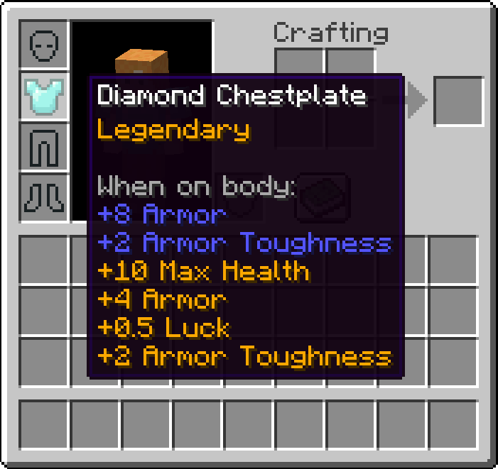

# Tiered

Tiered is a fork of [Reforged](https://modrinth.com/mod/tiered), which is a fork of Original [Tiered](https://www.curseforge.com/minecraft/mc-mods/tiered), what inspired by [Quality Tools](https://www.curseforge.com/minecraft/mc-mods/quality-tools). Every tool you make will have a special modifier.

Key differences: Removed the use of [Unionlib](https://modrinth.com/mod/unionlib); implemented reforging (it supposedly existed in Reforged, but I couldn't actually reforge anything there), configs now uses [Cloth Config](https://modrinth.com/mod/cloth-config) API, added (or fixed?) reforging, added new features for translation, 3 hammers replaced with 1 universale hammer, added Ukrainian.

### License
Tiered is licensed under MIT. You are free to use the code inside this repo as you want.
